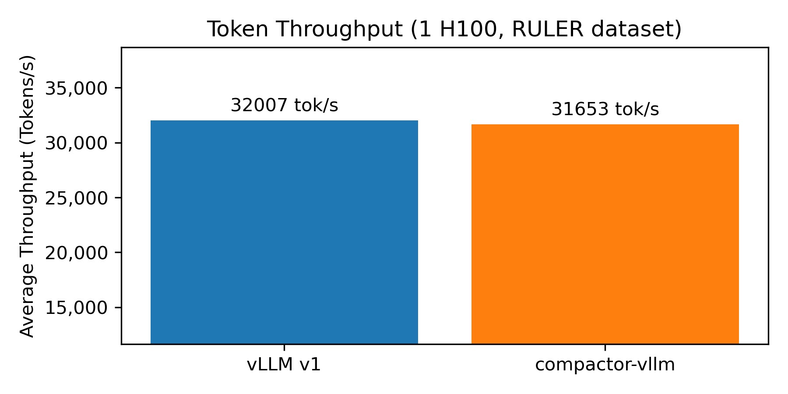
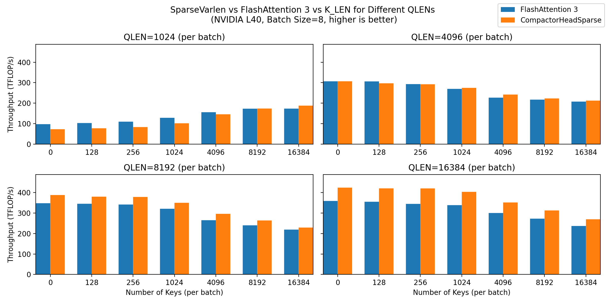

# compactor-vllm

_Triton-based attention and (nearly) zero-overhead KV-cache compression in a minimal vLLM-style engine._

Long-context LLMs quickly become bottlenecked by the size of the key–value (KV) cache: memory usage and bandwidth both scale linearly with the number of tokens. **compactor-vllm** is a small, research-friendly inference engine that combines:

- a paged KV cache manager,
- custom Triton kernels for sparse variable-length attention, and fast KV compression
- training-free KV-cache compression (Compactor and SnapKV),

to make long-context inference more practical.

To accelerate the KV cache compression, we have carefully tuned a series of Triton kernels to accelerate all aspects of KV 
compression, including a series of tuned Triton attention kernels that are **faster** than 
FlashAttention3 in a variety of long context tasks (benchmarked on H100, L40, A100, H100 NVL, H200).

We achieve zero-overhead KV cache compression by carefully overlapping the KV compression 
operations with memory-bound portions of the prefill process.

## Speed



## Task Performance

| Percent KV discarded | 0.0   | 0.25  | 0.5   | 0.75  | 0.95  |
|----------------------|-------|-------|-------|-------|-------|
| Llama 3.1-8B         | 95.39 | 95.63 | 94.75 | 83.07 | 64.79 |
| Qwen3-8B             | 95.01 | 94.57 | 92.29 | 76.48 | 44.69 |

---
 
## Installation

[//]: # ()
[//]: # (### From PyPI &#40;recommended&#41;)

[//]: # ()
[//]: # (Once published:)

[//]: # ()
[//]: # (```bash)

[//]: # (pip install compactor-vllm)

[//]: # (````)

### From source

```bash
git clone https://github.com/vnchari/compactor_vllm.git
cd compactor_vllm
pip install -e .
```
---

## Quickstart

### Basic text generation with compression

`LLM.generate_chat` wraps Hugging Face’s `apply_chat_template` to make chat-style usage easier:

```python
from compactor_vllm import (
    LLM,
    LLMConfig,
    SamplingParams,
    CompressionMethod,
)

from compactor_vllm.compression import (
    BatchCompressionParams,
    SequenceCompressionParams
)

config = LLMConfig(
    model="Qwen/Qwen3-8B",
    max_model_len=40960,
)

llm = LLM(config)
sampling = SamplingParams(temperature=0.7, max_new_tokens=256)
compression = BatchCompressionParams(
    compression_method=CompressionMethod.COMPACTOR,  # or CompressionMethod.SNAPKV
)

# Batch of conversations (each is a list of role/content dicts)
messages_batch = [
    [
        {"role": "system", "content": "You are a helpful assistant."},
        {"role": "user", "content": "Summarize the main idea of KV cache compression."},
    ],
]
sequence_level_compression = SequenceCompressionParams(compression_ratio=1.0)
answers = llm.generate_chat(
    messages_batch=messages_batch,
    sampling_params=sampling,
    batch_compression_params=compression,
    per_sequence_compression_params=sequence_level_compression
)
print(answers[0])
```

---

## Features

* **End-to-end LLM engine**

  * Minimal, vLLM-style engine that manages tokenization, scheduling, KV-cache, and sampling.
  * Multi-process, multi-GPU tensor-parallel inference via `torch.distributed`.

* **Fast Attention Primitives for Head-Sparse Attention**

  * `AttentionBackend.COMPACTOR_TRITON`: custom Triton kernel for sparse variable-length attention with KV caching (i.e each head might have variable lengths) .
  * Faster than FlashAttention3 for long contexts (even under full KV cache/no compression)

* **Paged KV-cache manager**

  * Paged KV layout with a `KVCacheManager` that allocates and reclaims slots per sequence.
  * Support for prefill + decode phases and arbitrary size batches. 

* **KV-cache compression**

  * Training-free, per-layer, per-token compression with:

    * **Compactor:** approximate leverage-score–based, query-agnostic compression.
    * **SnapKV:** compression using recent attention scores.
  * Pluggable compression registry (`COMPRESSION_REGISTRY`) for adding new methods.

---

## Compression methods

All compression methods inherit from a common `BaseCompressionMethod` and are registered in `COMPRESSION_REGISTRY`.

### CompressionMethod

```python
from compactor_vllm.compression import CompressionMethod

print(list(CompressionMethod))
# [CompressionMethod.COMPACTOR, CompressionMethod.SNAPKV, CompressionMethod.NONE]
```

* `COMPACTOR`

  * Implements the **Compactor** algorithm: a parameter-free, query-agnostic KV compression strategy based on approximate leverage scores.
  * Operates in two phases:

    * **Pre-RoPE scoring:** computes a low-rank sketch of key states and approximates leverage scores.
    * **Post-RoPE scoring:** optionally refines importance using attention-like quantities.
  * Designed to keep a small subset of tokens while matching full-KV performance on long-context tasks.

* `SNAPKV`

  * Implements SnapKV-style compression using streaming attention statistics.
  * Uses recent queries’ attention weights to score keys and periodically prunes the least important ones.
  * Well suited for query-aware and streaming scenarios.

* `NONE`

  * Baseline: no KV compression. The engine behaves like a standard LLM with a paged KV cache.

### Batch-level compression configuration

Batch-level options live in `BatchCompressionParams`:

```python
from compactor_vllm.compression import BatchCompressionParams, CompressionMethod

compression = BatchCompressionParams(
    compression_method=CompressionMethod.COMPACTOR,
    # compression_type, chunking, etc. remain at their defaults
)
```

You pass this structure into both `generate` and `generate_chat`. Sequence-level overrides are handled internally via `SequenceCompressionParams` attached to each `Sequence`.

---

## Attention backends

Select the attention implementation via `EngineConfig.attention_backend`:

```python
from compactor_vllm import LLMConfig, AttentionBackend

config = LLMConfig(
    model="meta-llama/Meta-Llama-3-8B",
    attention_backend=AttentionBackend.COMPACTOR_TRITON,
)
```

* **COMPACTOR_TRITON**

  * Uses `attention/sparse_varlen_kernel.py` and `triton_kernels/` to run a fused, sparse variable-length attention kernel.
  * Designed to work hand-in-hand with the paged KV cache and compression.

* **FLASH_ATTENTION**

  * Uses FlashAttention 2 as a reference backend.
  * Useful for ablations (same model, same scheduler, different attention implementation).

---

## Supported models

Model support is implemented in `models/` and wired via `MODEL_REGISTRY`:

* **Llama 3 family**

  * `LlamaForCausalLM` implementation tailored to the compactor-vllm layers and attention backends.
* **Qwen3**

  * `Qwen3ForCausalLM` for dense Qwen3 models.
* **Qwen3 MoE**

  * `Qwen3MoeForCausalLM` with a custom MoE layer (`layers/moe.py`).

Any Hugging Face checkpoint with `config.model_type` in:

```python
from compactor_vllm.models import MODEL_REGISTRY
print(MODEL_REGISTRY.keys())
# dict_keys(["llama", "qwen3", "qwen3_moe"])
```

should work out-of-the-box. Adding support for a new architecture involves:

1. Implementing a `*ForCausalLM` module under `models/` using the shared `layers/`.
2. Registering it in `MODEL_REGISTRY`.

---

### Kernel tests

There are lightweight tests for KV-cache and attention kernels:

* `compactor_vllm/attention/test_triton_attention.py`
* `compactor_vllm/kv_cache/test_store_kv.py`

You can run them with:

```bash
pytest -q
```

(on a CUDA-enabled machine).

---

## Project structure

A quick overview of the main modules:

* `compactor_vllm/core/`

  * `llm_engine.py`: high-level `LLMEngine` (exposed as `LLM`).
  * `model_runner.py`: per-rank process running the model and sampler.
  * `scheduler.py`: schedules prefill and decode steps and maintains sequence states.
  * `memory_manager.py`: `KVCacheManager` + paged KV-cache allocation.

* `compactor_vllm/compression/`

  * `common.py`: `CompressionMethod`, `BaseCompressionMethod`, and shared interfaces.
  * `compactor.py`: Compactor compression (approximate leverage scores + Triton kernels).
  * `snapkv.py`: SnapKV compression.
  * `compression_params.py`: `BatchCompressionParams` and sequence-level control.

* `compactor_vllm/kv_cache/`

  * `page_table.py`: `PagedKVCache` abstraction.
  * `write_page_table.py`, `store_kv_cache.py`: Triton kernels to write and update paged KV.

* `compactor_vllm/attention/`

  * `sparse_varlen_kernel.py`: fused sparse variable-length attention with cache.
  * `sparse_decode_kernel.py`: decoding-time attention.
  * `compile_kernels.py`: helper script for ahead-of-time kernel compilation.

* `compactor_vllm/layers/`

  * `attention.py`, `embed_head.py`, `layernorm.py`, `linear.py`, `moe.py`, etc.

* `compactor_vllm/utils/`

  * `sequence.py`: `Sequence` and `SequenceStatus` abstraction.
  * `context.py`: per-batch context object (e.g. batch mappings, temp buffers).
  * `helpers.py`, `loader.py`, `arguments.py`: small utilities.

---

## Hardware and software requirements

* **Python:** 3.10+
* **GPU:** NVIDIA GPU with CUDA support.
* **Software stack:**

  * PyTorch with CUDA.
  * Transformers (for tokenization and HF model loading).
  * Triton (for custom kernels).
  * FlashAttention 2 (optional; only needed for the FlashAttention backend and the benchmark script).

The code is written with long-context models in mind (tens of thousands of tokens), so VRAM capacity and bandwidth will heavily affect achievable throughput.

---

## Extending compactor-vllm

### Adding a new compression method

1. Implement a subclass of `BaseCompressionMethod` in `compression/your_method.py`.
2. Register it in `COMPRESSION_REGISTRY` in `compression/__init__.py`.
3. Expose a new `CompressionMethod` enum value.

Your implementation can override:

* `pre_rope_scoring(...)`
* `post_rope_scoring(...)`

and return per-token importance scores for top-k selection.

### Adding a new model family

1. Implement a `*ForCausalLM` under `models/` using `layers/`.
2. Register the model under an appropriate `hf_config.model_type` key in `MODEL_REGISTRY`.

---

## Citation

If you use **compactor-vllm** or the Compactor method in your research, please consider citing the Compactor paper:

```bibtex
@article{chari2025compactor,
  title   = {Compactor: Calibrated Query-Agnostic KV Cache Compression with Approximate Leverage Scores},
  author  = {Vivek Chari and Benjamin Van Durme},
  journal = {arXiv preprint arXiv:2507.08143},
  year    = {2025},
  url     = {https://arxiv.org/abs/2507.08143}
}
```
