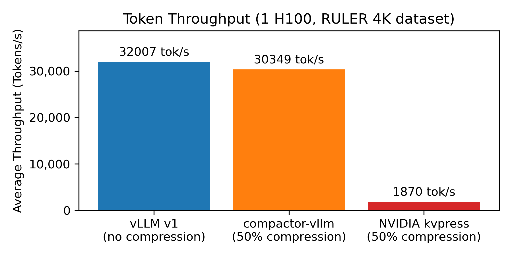
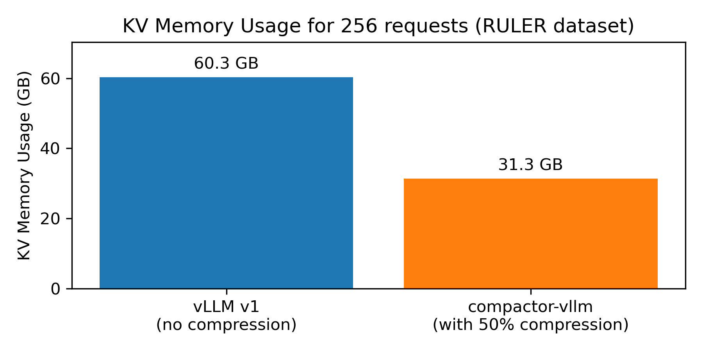
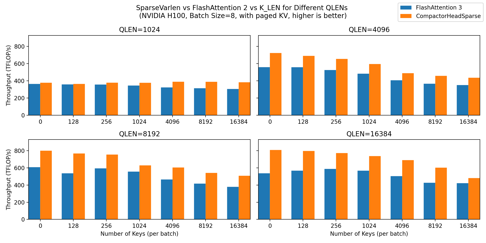

# compactor-vllm
[](https://arxiv.org/abs/2507.08143)
[](https://opensource.org/licenses/MIT)

**Nearly zero-overhead KV-cache compression in a minimal vLLM-style engine**

Long-context LLMs quickly become bottlenecked by the key–value (KV) cache: memory usage and bandwidth both scale linearly with the number of tokens. **compactor-vllm** is a small, simple inference engine that makes long-context inference more practical by combining:

- **Paged KV cache manager** – for efficient memory allocation and management
- **Custom Triton kernels** – for sparse (and dense) variable-length attention and fast KV compression 
- **Training-free KV compression** – out-of-the-box, with the Compactor compression method. 

## Key Features

### 🚀 Speed
Custom Triton attention kernels for head-sparse that outperform FlashAttention2 by up to 45% on long-context tasks, for compressed and uncompressed KV caches (benchmarked and tuned on H100, L40, A100, H100 NVL, H200). Over 15x faster than NVIDIA's KVPress Library for KV Cache Compression

### 💾 Memory Efficiency
Achieve up to 50% memory savings while maintaining strong task performance.

### ⚡ Zero-Overhead Compression
Carefully overlapped KV compression operations with memory-bound portions of the prefill process.

### ❗ Use Cases
- **Long-document QA** - Reduce memory for 100K+ token contexts
- **Multi-turn conversations** - Compress chat history while maintaining quality
- **RAG systems** - Handle large retrieved contexts efficiently
- **Batch processing** - Increase batch sizes with compressed KV cache
### ⏱️ Coming Soon
- **Prefix Caching**         
- **Calibrated Compression - automatically determine how much compression your context can tolerate**
- **More Models**
- **More Compression Methods**
- **Fine-grained Compression Policies** - Specify specific regions of the context to compress (i.e don't compress system prompt, but compress few-shot exemplars).

---

## Performance

### Throughput Comparison (50% KV Retention)

At 50% KV retention, compactor-vllm achieves comparable throughput to **uncompressed vLLM** while using significantly less memory.



### Memory Usage (60% KV Retention)

On the RULER 4K dataset with an H100 GPU, compactor-vllm reduces peak KV cache memory from 60GB to 36GB – a 40% reduction, as expected.



### Task Performance (RULER Benchmark, Compactor KV Compression, Query Agnostic)

| KV Discarded | 0%    | 25%   | 50%   | 75%   | 95%   |
|--------------|-------|-------|-------|-------|-------|
| Llama 3.1-8B | 95.39 | 95.63 | 94.75 | 83.07 | 64.79 |
| Qwen3-8B     | 95.01 | 94.57 | 92.29 | 76.48 | 44.69 |

At 50% compression, both models maintain over **97%** of their full-cache performance. Most tasks can tolerate 
at least 50% KV compression, and some can tolerate even more! An example of a RULER question: 
> A special magic uuid is hidden within the following text. Make sure to memorize it. I will quiz you about the uuid afterwards.
One of the special magic uuids for 3ce915e7-c9d6-463b-8a3c-6f5f5bb5c40c is: 2c9b662e-040a-4aae-92e2-afd996bf10ab.<br> ...<br>
One of the special magic uuids for bde13c1b-2073-4f6d-8d6a-05b343ef2016 is: bee3eb79-1d18-4ee9-86ad-8a8c6bc4123e.
What is the special magic uuid for a93b12cd-1c24-420e-acab-d7e7cc6b66e5 mentioned in the provided text?

### Attention Kernel Performance

Our Triton kernels match outperform FlashAttention2 by upto 45% across different sequence lengths.
and KV cache sizes, **even for uncompressed caches**:
---

## Installation

### From Source

```bash
git clone https://github.com/vnchari/compactor_vllm.git
cd compactor_vllm
pip install -e .
```

### Requirements

- Python 3.10+
- NVIDIA GPU with CUDA support
- PyTorch with CUDA
- Transformers (for model downloading)
- Triton
- FlashAttention

### Autotuning kernels
You can autotune kernels ahead of time instead of occuring at first use. Autotuning results are
automatically cached to the disk, so they only need to be done once per attention configuration 
```bash
python3 compactor_vllm/attention/compile_kernels.py --max-length 16384 --HKV 8 --HQ 32 --D 128 --page-size 128
```
---

## Quick Start

### Basic Chat Generation with Compression

```python
from compactor_vllm import (
    LLM,
    LLMConfig,
    SamplingParams,
    CompressionMethod,
)
from compactor_vllm.compression import (
    BatchCompressionParams,
    SequenceCompressionParams
)

# Configure the model
config = LLMConfig(
    model="Qwen/Qwen3-8B",
    max_model_len=40960,
)

llm = LLM(config)

# Set up sampling parameters
sampling = SamplingParams(temperature=0.7, max_new_tokens=256)

# Configure compression
compression = BatchCompressionParams(
    compression_method=CompressionMethod.COMPACTOR,  # or SNAPKV
)

# Create conversation
messages_batch = [
    [
        {"role": "system", "content": "You are a helpful assistant."},
        {"role": "user", "content": "Summarize the main idea of KV cache compression."},
    ],
]

# Generate with 50% KV retention
sequence_compression = SequenceCompressionParams(compression_ratio=0.5)
answers = llm.generate_chat(
    messages_batch=messages_batch,
    sampling_params=sampling,
    batch_compression_params=compression,
    per_sequence_compression_params=sequence_compression
)
print(answers[0])
```

---

## Core Components

### Compression Methods

compactor-vllm supports multiple KV cache compression strategies:

#### **COMPACTOR**
- Query-agnostic compression based on approximate leverage scores
- Training-free and parameter-free
- Maintains strong performance with aggressive compression ratios

#### **SnapKV**
- Query-aware compression using recent-token attention statistics
- Well-suited for scenarios where the question is known at inference-time

#### **None**
- Baseline with no compression
- Standard paged KV cache behavior

### Attention Backends

Choose your attention implementation via `attention_backend`:

```python
from compactor_vllm import LLMConfig, AttentionBackend

config = LLMConfig(
    model="meta-llama/Meta-Llama-3.1-8B-Instruct",
    attention_backend=AttentionBackend.COMPACTOR_TRITON,  # Recommended
)
```

**COMPACTOR_TRITON**: Custom sparse variable-length attention kernel optimized for long contexts and compressed KV caches. Was developed in order to support prefix-caching (coming soon!) 

**FLASH_ATTENTION**: FlashAttention reference backend.

### Supported Models

Models are registered in `MODEL_REGISTRY` and include:

- **Llama 3 family** – Full support for Meta's Llama 3 models
- **Qwen3** – Dense Qwen3 models
- **Qwen3 MoE** – Mixture-of-Experts Qwen3 variants

Check supported architectures:
```python
from compactor_vllm.models import MODEL_REGISTRY
print(list(MODEL_REGISTRY.keys()))
# ['llama', 'qwen3', 'qwen3_moe']
```

---

## Advanced Usage

### Configuring Compression Ratios

Control how aggressively to compress the KV cache:

```python
from compactor_vllm.compression import SequenceCompressionParams
# Retain 50% of KV cache (discard 50%)
sequence_compression = SequenceCompressionParams(compression_ratio=0.5)

# More aggressive: retain only 25%
sequence_compression = SequenceCompressionParams(compression_ratio=0.25)
```

### Multi-GPU Inference

compactor-vllm supports tensor-parallel inference across multiple GPUs using `torch.distributed`. Specify `tensor_parallel_size` in ``LLMConfig``

### Batch Processing

Process multiple conversations efficiently:

```python
messages_batch = [
    [{"role": "user", "content": "Question 1"}],
    [{"role": "user", "content": "Question 2"}],
    [{"role": "user", "content": "Question 3"}],
]

answers = llm.generate_chat(
    messages_batch=messages_batch,
    sampling_params=sampling,
    batch_compression_params=compression,
)
```

---

## Extending compactor-vllm

### Adding a New Compression Method

1. Create a subclass of `BaseCompressionMethod`:

```python
# compression/my_method.py
from compactor_vllm.compression import BaseCompressionMethod

class MyCompressionMethod(BaseCompressionMethod):
    def pre_rope_scoring(self, ...):
        # Implement scoring logic
        pass
    
    def post_rope_scoring(self, ...):
        # Optional refinement
        pass
```

2. Register in `compression/__init__.py`:

```python
from compactor_vllm.compression import COMPRESSION_REGISTRY, CompressionMethod

COMPRESSION_REGISTRY[CompressionMethod.MY_METHOD] = MyCompressionMethod
```

### Adding a New Model Architecture

1. Implement `*ForCausalLM` under `models/` using shared `layers/`
2. Register in `MODEL_REGISTRY` with the appropriate `model_type` key

---

## Testing

Run kernel and component tests:

```bash
pytest tests/
```
---

## Project Structure

```
compactor_vllm/
├── core/              # Engine, scheduler, memory management
│   ├── llm_engine.py
│   ├── model_runner.py
│   ├── scheduler.py
│   └── memory_manager.py
├── compression/       # Compression methods and configuration
│   ├── compactor.py
│   ├── snapkv.py
│   └── compression_params.py
├── attention/         # Attention kernels and backends
│   ├── sparse_varlen_kernel.py
│   └── sparse_decode_kernel.py
├── kv_cache/         # Paged KV cache implementation
│   ├── page_table.py
│   └── store_kv_cache.py
├── layers/           # Model layers
│   ├── attention.py
│   ├── moe.py
│   └── ...
├── models/           # Model implementations
│   ├── llama.py
│   ├── qwen3.py
│   └── ...
├── utils/            # Utilities and helpers
└── triton_kernels/   # Fast MOE kernels from Triton Lang repo 
```

---

## Citation

If you use compactor-vllm or the Compactor method in your research, please cite:

```bibtex
@article{chari2025compactor,
  title   = {Compactor: Calibrated Query-Agnostic KV Cache Compression with Approximate Leverage Scores},
  author  = {Vivek Chari and Benjamin Van Durme},
  journal = {arXiv preprint arXiv:2507.08143},
  year    = {2025},
  url     = {https://arxiv.org/abs/2507.08143}
}
```

---

## Contributing

Contributions are welcome! Please feel free to submit a Pull Request.

## Acknowledgments

* See https://github.com/NVIDIA/kvpress for additional compression methods in an easy-to-use format

## MIT License 

THE SOFTWARE IS PROVIDED “AS IS”, WITHOUT WARRANTY OF ANY KIND, EXPRESS OR IMPLIED, INCLUDING BUT NOT LIMITED TO THE WARRANTIES OF MERCHANTABILITY, FITNESS FOR A PARTICULAR PURPOSE AND NONINFRINGEMENT. IN NO EVENT SHALL THE AUTHORS OR COPYRIGHT HOLDERS BE LIABLE FOR ANY CLAIM, DAMAGES OR OTHER LIABILITY, WHETHER IN AN ACTION OF CONTRACT, TORT OR OTHERWISE, ARISING FROM, OUT OF OR IN CONNECTION WITH THE SOFTWARE OR THE USE OR OTHER DEALINGS IN THE SOFTWARE.

